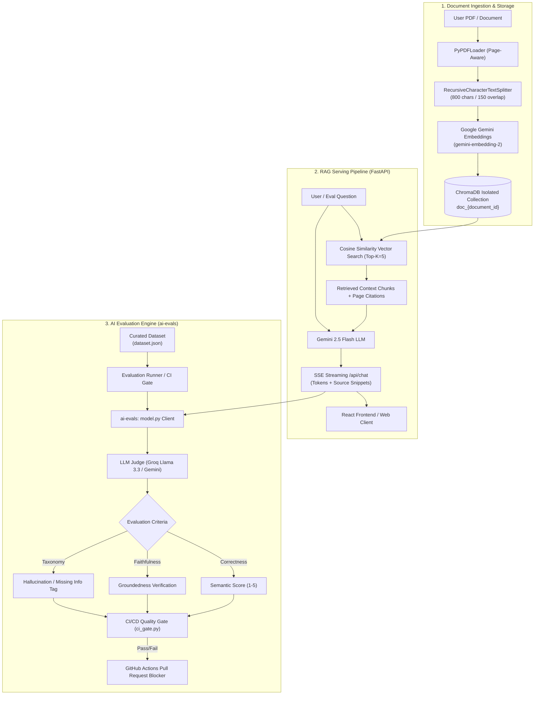

# 🧠 AIEvaluationEngineRAG

<div align="center">


**An enterprise-grade, end-to-end Document Retrieval-Augmented Generation (RAG) system paired with an automated 6-Level AI Evaluation Framework & CI/CD Quality Gate.**

[Overview](#-overview) •
[Architecture](#-system-architecture) •
[The 6-Level Evaluation Suite](#-the-6-level-ai-evaluation-framework) •
[Quickstart](#-quickstart-guide) •
[Evaluation CLI](#-evaluation-cli-reference) •
[CI/CD Gate](#-cicd-quality-gate) •
[Latest Benchmarks](#-evaluation-benchmarks)

</div>

---

## 📌 Overview

**AIEvaluationEngineRAG** bridges the critical gap between building generative AI prototypes and deploying reliable, regression-proof AI systems into production.

The repository contains two core, tightly integrated components:

1. **`RAGnition` (Full-Stack Document AI Assistant)**:
   - High-throughput RAG pipeline powered by **FastAPI**, **LangChain**, and **Google Gemini 2.5 Flash**.
   - Per-document isolated **ChromaDB** vector collections with page-aware recursive text splitting.
   - Real-time token streaming via **Server-Sent Events (SSE)**.
   - Grounded citations with **page-level snippets** presented in a sleek **React 18 + TypeScript + Vite** frontend.

2. **`ai-evals` (Continuous AI Evaluation Engine & CI/CD Gate)**:
   - Multi-tiered evaluation framework running automated benchmarks on **Correctness**, **Relevance**, and **RAG Faithfulness / Groundedness**.
   - **LLM-as-a-Judge** scoring engine with structured JSON reasoning.
   - Comprehensive **Failure Taxonomy** classifying hallucinations, unsupported claims, and missing information.
   - Automated **A/B Testing & Regression Detection** comparing baseline vs. candidate model/prompt variations.
   - **CI/CD Quality Gate** for GitHub Actions that blocks merges if pass rate, faithfulness, or judge scores fall below required thresholds.
   - Synthetic test dataset generator for automated edge case and out-of-scope testing.

---

## 🏛️ System Architecture



---

## 🧪 The 6-Level AI Evaluation Framework

This project follows an industry-standard 6-level progression for validating and safeguarding RAG pipelines:

| Level | Name | Description | Implementation File |
| :---: | :--- | :--- | :--- |
| **L1** | **Dataset & Ground Truth** | Deterministic reference questions, expected answers, and known context baselines. | [`dataset.json`](ai-evals/dataset.json), [`knowledge.json`](ai-evals/knowledge.json) |
| **L2** | **Failure Taxonomy & Rubrics** | Granular failure categorization (`hallucination`, `unsupported_claim`, `missing_information`, `incorrect_answer`, `irrelevant_answer`). | [`evaluator.py`](ai-evals/evaluator.py) |
| **L3** | **LLM-as-a-Judge** | Automated semantic scoring on a 1–5 scale with JSON schema enforcement and granular chain-of-thought rationale. | [`evaluator.py`](ai-evals/evaluator.py) |
| **L4** | **RAG Faithfulness** | Strict context groundedness checks to ensure answers do not rely on outside parametric memory or fabricate claims. | [`evaluator.py`](ai-evals/evaluator.py) |
| **L5** | **A/B Testing & Regressions** | Side-by-side prompt/model version diffing with delta metrics ($\Delta\text{Pass Rate}$, $\Delta\text{Score}$) to catch regressions before deploy. | [`compare.py`](ai-evals/compare.py) |
| **L6** | **CI/CD Quality Gate** | Automated CLI script returning exit code `0` or `1` integrated into GitHub Actions workflow. | [`ci_gate.py`](ai-evals/ci_gate.py), [`.github/workflows/evals.yml`](ai-evals/.github/workflows/evals.yml) |

---

## 📂 Repository Layout

```
AIEvaluationEngineRAG/
├── RAGnition-main/                   # Full-Stack Document RAG Application
│   ├── backend/                      # FastAPI Backend
│   │   ├── app/
│   │   │   ├── api/
│   │   │   │   ├── chat.py           # SSE Streaming Chat API (/api/chat)
│   │   │   │   └── upload.py         # File ingestion & indexing API (/api/upload)
│   │   │   ├── core/
│   │   │   │   ├── config.py         # Settings & hyperparameter knobs
│   │   │   │   ├── document_store.py # PDF parsing, chunking & ChromaDB indexing
│   │   │   │   └── rag_chain.py      # LangChain RAG pipeline & prompt templates
│   │   │   ├── models/schemas.py     # Pydantic v2 schemas
│   │   │   └── main.py               # FastAPI application entrypoint & CORS
│   │   ├── requirements.txt          # Backend dependencies
│   │   └── .env.example              # Sample backend environment configuration
│   │
│   └── frontend/                     # React 18 + TypeScript + Vite UI
│       ├── src/
│       │   ├── api/client.ts         # SSE streaming & document upload client
│       │   ├── components/           # UploadView, ChatView, MessageBubble, SourcesPanel
│       │   ├── hooks/useChat.ts      # Multi-turn streaming state management
│       │   └── App.tsx               # Main frontend interface
│       ├── package.json
│       └── vite.config.ts
│
├── ai-evals/                         # Continuous AI Evaluation & Quality Gate Suite
│   ├── .github/workflows/
│   │   └── evals.yml                 # GitHub Actions automated PR check workflow
│   ├── results/
│   │   ├── latest.json               # Full output and logs from latest eval run
│   │   └── compare_latest.json       # A/B regression test diff report
│   ├── ci_gate.py                    # CI threshold gate (pass/fail exit code)
│   ├── compare.py                    # Side-by-side A/B evaluation runner
│   ├── evaluator.py                  # LLM Judge prompt, rubric & JSON scorer
│   ├── generate_dataset.py           # Synthetic dataset generator for RAG
│   ├── model.py                      # Integration wrapper querying RAG backend
│   ├── runner.py                     # Standard test runner with console reporter
│   ├── dataset.json                  # Curated golden evaluation dataset
│   ├── knowledge.json                # Source document knowledge ground truth
│   └── requirements.txt              # Evaluation runner dependencies
│
├── enhancement.md                    # Strategic architecture notes (Hybrid regex + LLM)
└── README.md                         # Project documentation
```

---

## ⚡ Quickstart Guide

### Prerequisites

- **Python 3.11+**
- **Node.js 18+** & **npm**
- **Google Gemini API Key** ([Google AI Studio](https://aistudio.google.com/))
- **Groq API Key** ([Groq Console](https://console.groq.com/)) *(for ultra-fast LLM evaluation)*

---

### Step 1: Start the RAG Backend

```powershell
# Navigate to backend directory
cd RAGnition-main/backend

# Create & activate virtual environment
python -m venv .venv
.venv\Scripts\activate      # On Windows
# source .venv/bin/activate # On Linux/macOS

# Install dependencies
pip install -r requirements.txt

# Create .env file and add your credentials
copy .env.example .env
```

Ensure `.env` contains:
```env
GOOGLE_API_KEY=your_gemini_api_key_here
GEMINI_MODEL=models/gemini-2.5-flash
EMBEDDING_MODEL=models/gemini-embedding-2
CHUNK_SIZE=800
CHUNK_OVERLAP=150
TOP_K=5
```

Launch the FastAPI server:
```powershell
uvicorn app.main:app --reload --port 8000
```
- API Endpoint: `http://localhost:8000`
- Interactive Swagger UI: `http://localhost:8000/docs`

---

### Step 2: Launch the Frontend

Open a new terminal window:

```powershell
cd RAGnition-main/frontend

# Install dependencies
npm install

# Start development server
npm run dev
```
- Application UI: `http://localhost:5173`
- Upload your document (e.g. PDF/TXT) through the interface. Note down the returned `document_id` displayed in logs/network or Swagger.

---

### Step 3: Configure & Run AI Evaluations

Open a separate terminal for the evaluation environment:

```powershell
cd ai-evals

# Create & activate dedicated virtual environment
python -m venv .venv
.venv\Scripts\activate      # On Windows
# source .venv/bin/activate # On Linux/macOS

# Install evaluation dependencies
pip install -r requirements.txt
```

Create a `.env` file in `ai-evals/`:
```env
GROQ_API_KEY=your_groq_api_key_here
RAG_BACKEND_URL=http://localhost:8000
DOCUMENT_ID=your_uploaded_document_id_here
```

---

## 💻 Evaluation CLI Reference

### 1. Run Standard Evaluations (Level 3 & 4)

Runs all test cases through the live RAG backend and scores each with the LLM Judge:

```powershell
python runner.py
```

**Console Output Highlights:**
- Live status per test case (`[PASS]`, `[FAIL]`, score 1–5, groundedness flag).
- Failure category tagging (`hallucination`, `missing_information`, etc.).
- Summary statistics: Overall Pass Rate, Faithfulness Rate, Average Score.
- Detailed execution results saved to `results/latest.json`.

---

### 2. Run A/B Testing & Regression Analysis (Level 5)

Compare changes between two prompt templates, chunk sizes, or model versions:

```powershell
python compare.py
```

Outputs:
- Metric deltas: $\Delta \text{Pass Rate}$, $\Delta \text{Faithfulness}$, $\Delta \text{Score}$
- Test classification:
  - 🚨 `REGRESSION`: Passed in baseline (Variant A), failed in candidate (Variant B)
  - ✨ `IMPROVEMENT`: Failed in baseline (Variant A), passed in candidate (Variant B)
  - ✅ `STABLE PASS` / ❌ `STABLE FAIL`
- Exports detailed comparison report to `results/compare_latest.json`.

---

### 3. Generate Synthetic Datasets

Automatically inspects `knowledge.json` and generates balanced evaluation test suites (in-scope facts, edge cases, and adversarial/out-of-scope questions):

```powershell
# Generate 10 test cases into synthetic_dataset.json
python generate_dataset.py --count 10

# Generate 15 test cases and append directly to dataset.json
python generate_dataset.py --count 15 --append
```

---

### 4. Run CI/CD Quality Gate (Level 6)

Asserts that the application satisfies predefined production quality bars:

```powershell
# Standard threshold assertion (80% pass rate, 85% faithfulness, 3.8/5 score)
python ci_gate.py

# Custom strict production threshold
python ci_gate.py --min-pass-rate 90.0 --min-faithfulness 95.0 --min-score 4.2
```

Returns:
- Exit code `0`: All thresholds met.
- Exit code `1`: Quality threshold violated (terminates CI pipeline).

---

## 🛡️ CI/CD Quality Gate (GitHub Actions)

The repository includes an automated GitHub Actions workflow (`.github/workflows/evals.yml`) that executes on every push and pull request:

```yaml
name: AI Evaluation Quality Gate

on:
  push:
    branches: [ main ]
  pull_request:
    branches: [ main ]

jobs:
  run-evals:
    name: Run AI Evals & Check Thresholds
    runs-on: ubuntu-latest
    steps:
      - uses: actions/checkout@v4
      - uses: actions/setup-python@v5
        with:
          python-version: '3.11'
          cache: 'pip'
      - name: Install dependencies
        run: pip install -r ai-evals/requirements.txt
      - name: Run CI Evaluation Quality Gate
        env:
          GROQ_API_KEY: ${{ secrets.GROQ_API_KEY }}
        run: |
          cd ai-evals
          python ci_gate.py --min-pass-rate 80.0 --min-faithfulness 85.0 --min-score 3.8
```

> **Setting up Secrets**: Add `GROQ_API_KEY` to your repository settings under **Settings > Secrets and variables > Actions**.

---

## 📊 Evaluation Benchmarks

Latest verified run on the benchmark test suite (`results/latest.json`):

| Metric | Target Threshold | Actual Result | Status |
| :--- | :---: | :---: | :---: |
| **Total Test Cases** | — | **15** | Completed |
| **Pass Rate** | $\ge 80.0\%$ | **86.7%** (13/15) | 🟢 PASSED |
| **RAG Faithfulness Rate** | $\ge 85.0\%$ | **93.3%** (14/15) | 🟢 PASSED |
| **Average Judge Score** | $\ge 3.80\text{ / }5.0$ | **4.67 / 5.0** | 🟢 PASSED |

### Failure Categorization Taxonomy

When an evaluation fails, the LLM Judge classifies the failure mode for rapid diagnosis:

```
                  ┌─ Hallucination (Fabricated entities/metrics)
                  ├─ Unsupported Claim (Outside retrieved context)
Failure Taxonomy ─┼─ Missing Information (Incomplete extraction)
                  ├─ Incorrect Answer (Contradicts reference answer)
                  └─ Irrelevant Answer (Off-topic / misses user intent)
```

---

## 💡 Strategic Takeaway: Hybrid Evals

As documented in [`enhancement.md`](enhancement.md):
- **Extractive Queries** (account numbers, dates, IDs, balances): Using an LLM Judge for strict numbers is slow and costly. A regex/exact match pre-gate achieves 0 token cost and 100% deterministic precision.
- **Complex Reasoning & Synthesis**: Use the LLM Judge specifically for summaries, multi-hop reasoning, and tone evaluation.
- **Hybrid Pipeline**: Combine deterministic exact match gates with targeted LLM-as-a-Judge semantic scoring for optimal latency, cost, and reliability.

---

## 👤 Author

**Falak Rana**
- Website: [falakrana.in](https://falakrana.in)
- GitHub: [@falakrana](https://github.com/falakrana)
- LinkedIn: [Falak Rana](https://www.linkedin.com/in/falak-rana/)

---

## 📄 License

This project is licensed under the [MIT License](LICENSE).
